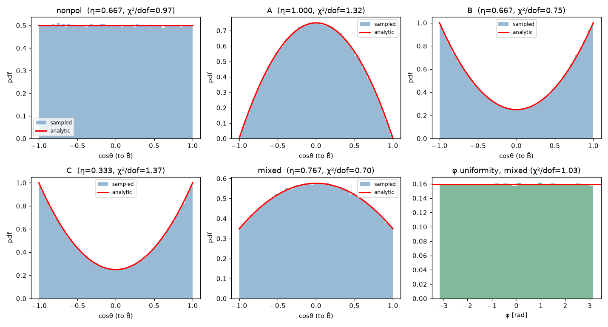

# RESULTS — Tier 1 (direction sampler, no transport)

OpenMC commit `608a1c338`; sampler = C++ standalone driver (`spf_driver`, OpenMC real `prn`); oracle = `spf_mirror.py`.

Histograms/χ²: N=1,000,000 per config; KS: N=300,000. Fixed seeds; regenerate with `python spf_prototype/python/verify_sampler.py`.

All numbers below are emitted verbatim by the script — no hand-tuning.

## §3.1  Mode-algebra identities (sympy)

- ∫dσ/dΩ dΩ = `a + 2*b/3 + c/3`  →  identity a+2b/3+c/3 holds: **True**
- ∫sin²θ dΩ = `8*pi/3` (=8π/3), ∫(¼+¾cos²θ)dΩ = `2*pi` (=2π)
- B and C share angular shape (bracket_B − 2·bracket_C = `0`)

| corner | (a,b,c) | σ_tot/σ₀ (sympy) | expected |
|---|---|---|---|
| nonpol | (1/3,1/3,1/3) | 2/3 | 2/3 |
| A | (1,0,0) | 1 | 1 |
| B | (0,1,0) | 2/3 | 2/3 |
| C | (0,0,1) | 1/3 | 1/3 |

## §3 C++ ↔ Python parity (bit-for-bit, identical seeds)

mixed mode, off-axis B̂, N=5000: **max|C++ − Python| = 6.106e-16**

## §3.2  cosθ distribution per mode (B̂=ẑ)

| mode | χ²/dof | p-value | min E | ⟨cos²θ⟩ obs | ⟨cos²θ⟩ exp |
|---|---|---|---|---|---|
| nonpol | 0.972 | 0.520 | 25000 | 0.3336 | 0.3333 |
| A | 1.324 | 0.084 | 1844 | 0.1997 | 0.2000 |
| B | 0.747 | 0.876 | 12531 | 0.4671 | 0.4667 |
| C | 1.370 | 0.062 | 12531 | 0.4667 | 0.4667 |
| mixed | 0.698 | 0.922 | 17952 | 0.2924 | 0.2928 |

φ uniformity (mixed): χ²/dof = 1.034, p = 0.414

## §3.3  Rotation: isotropy preservation + steering (off-axis B̂)

- Isotropic source rotated by off-axis B̂ stays isotropic on the sphere: χ²/dof = 0.985, p = 0.536

| mode | ⟨(u·B̂)²⟩ obs | oracle | max‖u‖−1 |
|---|---|---|---|
| A | 0.1996 | 0.2000 | 4.4e-16 |
| B | 0.4662 | 0.4667 | 4.4e-16 |
| C | 0.4662 | 0.4667 | 4.4e-16 |
| nonpol | 0.3327 | 0.3333 | 4.4e-16 |
| A, B̂=(0,0,+1) | 0.1998 | 0.2000 (⊥) | 2.2e-16 |
| A, B̂=(0,0,-1) | 0.1998 | 0.2000 (⊥) | 2.2e-16 |

## §3.4  Inverse-CDF vs rejection (two-sample KS)

| shape via mode | KS D | p-value |
|---|---|---|
| sin²θ (perp) | 3.147e-03 | 0.102 |
| ¼+¾cos²θ (par) | 1.843e-03 | 0.687 |

**Tier-1 gate: all checks pass.** See `tests/` for the pytest assertions.
