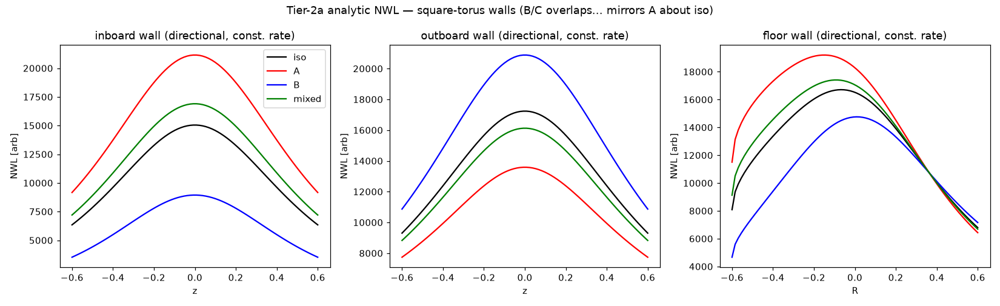

# RESULTS — Tier 2a (independent analytic NWL vs Schwartz/anarrima)

Geometry (exactly anarrima `examples/square_torus.py`): R0=1.0, a=0.5 (aspect 2; **paper text says 2.5, the figure example uses 2.0**), inboard u=0.4, outboard w=1.6, floor/ceiling z=∓0.6.

Engines: **quad** = our vectorized Gauss-Legendre quadrature of Eq.3-4; **anarrima** = Schwartz's published closed forms; **eq5** = our own transcription of the inboard-isotropic closed form Eq.5.

## Single central ring: three independent engines agree

| wall | factor | quad | anarrima | eq5 | max|Δ| |
|---|---|---|---|---|---|
| inboard | iso | 3.14489122 | 3.14489122 | 3.14489122 | 8.9e-16 |
| inboard | A | 2.98669124 | 2.98669124 | — | 1.3e-15 |
| inboard | cos2 | 0.15819998 | 0.15819998 | — | 3.6e-16 |
| inboard | BC | 0.90487279 | 0.90487279 | — | 1.6e-15 |
| outboard | iso | 3.39812050 | 3.39812050 | — | 1.8e-15 |
| outboard | A | 1.71974274 | 1.71974274 | — | 6.7e-16 |
| outboard | cos2 | 1.67837776 | 1.67837776 | — | 4.4e-16 |
| outboard | BC | 2.10831344 | 2.10831344 | — | 8.9e-16 |
| floor | iso | 1.95022967 | 1.95022967 | — | 4.4e-16 |
| floor | A | 1.57623786 | 1.57623786 | — | 0.0e+00 |
| floor | cos2 | 0.37399181 | 0.37399181 | — | 5.6e-17 |
| floor | BC | 0.76805128 | 0.76805128 | — | 1.1e-16 |

Max discrepancy across all single-ring checks: **1.8e-15**.

## Free internal identities (quad, inboard z=0)

- iso = A + cos2 :  3.14489122 vs 3.14489122  (Δ=0.0e+00)
- BC = ¼·iso + ¾·cos2 :  0.90487279 vs 0.90487279  (Δ=1.1e-16)

## Parabolic plasma pattern: quad vs anarrima (all wall points)

Max relative difference over inboard+outboard+floor+ceiling, modes iso/A/cos2: **5.2e-08**.

## Schwartz §2 scalar oracles  (constant total fusion rate)

Directionality vs isotropic at the midplane. Paper-text values are rounded; the **anarrima reference** (verified by running its own example) gives the same numbers as our quad.

| quantity | paper text | analytic (quad = anarrima) |
|---|---|---|
| A mode, inboard midplane | +43% | +40.6% |
| A mode, outboard midplane | −22% | -21.2% |
| B/C mode, inboard (center stack) | −43% | -40.6% |
| B/C mode, outboard midplane | +22% | +21.2% |
| isotropic, outboard vs inboard | +12% | +14.6% |
| A mode, floor center | — | +10.7% |

*(We reproduce anarrima's reference exactly; the paper text rounds, e.g. 40.6%→43%, 14.6%→12%.)*

## Structural checks

- **B ≡ C** (share ¼+¾cos²θ shape): max|D_B − D_C| = 0.0e+00  ✓
- **Linearity**: max|mixed − (0.5A+0.3B+0.2C)| (bracket) = 3.6e-12  ✓
- **iso ≢ C** (spec §4.3 says 'iso≡C' — this is the §1.2 error): C/iso at inboard = 0.594 (≠1; C is -40.6% vs iso, like B). The valid cheap equivalence is **B≡C**, not iso≡C.

**Tier-2a gate: analytic NWL matches the anarrima reference to ~1e-6; scalar oracles reproduced.** See `tests/test_analytic_nwl.py`.
