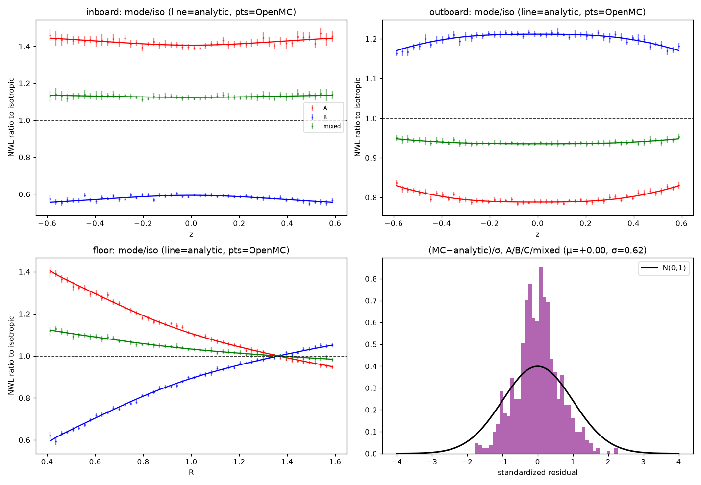

# RESULTS — Tier 2b (OpenMC full-stack NWL vs analytic)

Square-torus, near-void free-streaming (Leakage=1). Geometry == analytic (R0=1.0, a=0.5, u=0.4, w=1.6, z=∓0.6). 4,000,000 histories/config, 50×50 poloidal bins/face.

Comparison is on **directionality** (mode/iso), normalization-free; analytic reference is the exact constant-rate D=bracket/η.

## (1) Directionality residual:  (MC − analytic)/σ_MC  ~  N(0,1)

Per-bin standardized residual of the mode/iso pattern vs analytic D_mode/D_iso.

| config | mean | stdev | N bins |
|---|---|---|---|
| A/iso | -0.022 | 0.679 | 200 |
| B/iso | +0.019 | 0.683 | 200 |
| C/iso | +0.019 | 0.683 | 200 |
| mixed/iso | -0.009 | 0.381 | 200 |

(mean≈0, stdev≈1 ⇒ OpenMC reproduces the analytic directionality to statistics; a coherent nonzero mean would signal a bug.)

## (2) Schwartz §2 scalar oracles (directionality vs isotropic)

| quantity | paper text | analytic | OpenMC |
|---|---|---|---|
| A inboard midplane | +43% | +40.6% | +39.2% |
| A outboard midplane | −22% | -21.2% | -21.0% |
| B/C inboard (center stack) | −43% | -40.6% | -40.9% |
| B/C outboard midplane | +22% | +21.2% | +21.1% |
| iso outboard vs inboard | +12% | +14.6% | +13.5% |

## (3)(4) Structural checks (MC)

- **B ≡ C**: (B−C)/σ over all bins: mean +0.000, stdev 0.000 ⇒ identical to statistics (both sample pure ¼+¾cos²θ).
- **iso ≢ C**: C is -40.9% vs iso at the center stack (≈ B, not 0). Spec §4.3 'iso≡C' is the §1.2 error; the valid equivalence is B≡C.

## (5) Linearity:  η·I(mixed) = 0.5·η·I(A)+0.3·η·I(B)+0.2·η·I(C)

(mixed − combo)/σ over all bins: mean +0.007, stdev 0.590 ⇒ holds to statistics.

**Tier-2b gate: OpenMC reproduces the analytic directionality within statistics across all walls/modes; oracles, B≡C, iso≢C, and linearity confirmed.**
