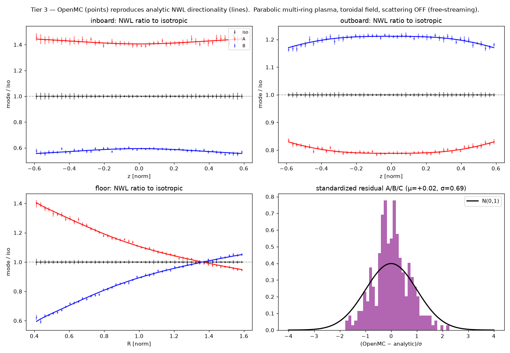
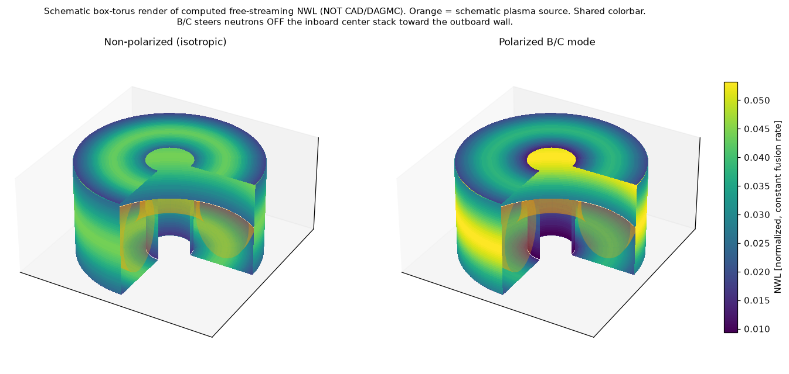

# RESULTS — Tier 3 (presentation artifacts; postprocessing only)

All numbers are postprocessing of the existing Tier-2b wall-current data (parabolic multi-ring plasma, toroidal field, scattering OFF, 4,000,000 histories/config, 50×50 bins/face) and the Tier-2a analytic reference. **No new transport runs.**

> **Scope / honesty:** NWL here is a *geometric, free-streaming* quantity (sightline regime, no scattering). It is **not** a shielded dose and **not** a TBR. Source is a filamentary/parabolic ring set; field is purely toroidal. Patterns are normalized to **constant total fusion rate** (each mode emits the same total), so differences are pure directionality.

## Peak NWL per wall, mode vs isotropic (% change)

| wall | iso (abs) | A | B | C |
|---|---|---|---|---|
| inboard | 0.039 | +39.5% | -40.9% | -40.9% |
| outboard | 0.044 | -21.0% | +21.1% | +21.1% |
| floor | 0.042 | +16.2% | -11.0% | -11.0% |
| ceiling | 0.043 | +16.0% | -11.6% | -11.6% |
| overall | 0.044 | +24.7% | +21.1% | +21.1% |

(iso column is the absolute normalized peak intensity; A/B/C are % change vs iso at constant fusion rate. B and C are identical by construction.)

## Peaking factor (peak / average) per mode — the engineering scalar

| wall | iso | A | B/C | Δ(B/C vs iso) | Δ(A vs iso) |
|---|---|---|---|---|---|
| inboard | 1.37 | 1.34 | 1.39 | +1.5% | -1.7% |
| outboard | 1.24 | 1.23 | 1.25 | +0.7% | -1.1% |
| floor | 1.31 | 1.38 | 1.30 | -0.8% | +5.5% |
| ceiling | 1.33 | 1.40 | 1.31 | -1.5% | +5.4% |
| overall | 1.33 | 1.65 | 1.61 | +21.1% | +24.7% |

**Honest finding (contrary to a naive 'polarization lowers peaking' expectation):** in this FIXED square geometry, *both* polarized modes RAISE the overall peaking factor vs isotropic (iso 1.33 → A 1.65, B/C 1.61). Directional emission concentrates the wall load, so the isotropic case is the most uniform. Per-wall peaking changes are small (±1.5%); the overall rise comes from the global peak intensifying at the outboard midplane (B/C) or relocating to the inboard midplane (A). The B/C engineering benefit here is therefore **not** a lower global peaking factor — it is the **center-stack (inboard) load reduction** (inboard peak −41%; inboard current fraction 8.7%→5.1%, see next table), which Schwartz highlights for spherical-tokamak center stacks. Schwartz's peaking-factor *reduction* result comes from re-shaping the first wall to exploit the steering — NOT modeled here (fixed square). Geometric free-streaming peaking, not shielded-dose peaking.

## Inboard vs outboard neutron-current fraction (geometric precursor, NOT a TBR)

| mode | inboard | outboard | floor | ceiling |
|---|---|---|---|---|
| iso | 8.7% | 42.6% | 24.4% | 24.3% |
| A | 12.3% | 34.0% | 26.9% | 26.8% |
| B | 5.1% | 51.2% | 21.9% | 21.8% |
| C | 5.1% | 51.2% | 21.9% | 21.8% |

**B/C moves 3.6 percentage points of total wall current off the inboard center stack** (inboard 8.7%→5.1%); the outboard wall gains 8.6 pts (42.6%→51.2%). A mode does the reverse. **This is the geometric precursor to a TBR argument — it is NOT a TBR**: a real TBR needs a breeder blanket + scattering, absent here (see LIMITATIONS.md).

## Analytic vs numerical (consolidated)

- **Tightest check (single central ring, no MC noise):** numerical quadrature vs anarrima closed form agree to **1.8e-15** across all walls/factors; our independent Eq.5 closed form agrees to **8.9e-16**.

- **Full-stack (parabolic multi-ring, OpenMC Monte Carlo vs analytic):** standardized directionality residual over all walls (A/B/C) has mean **+0.02**, stdev **0.69** ⇒ OpenMC reproduces the analytic to statistics (σ<1 ⇒ the 10-batch tally error bars are mildly conservative; no bias).

*3D: schematic box-torus render of the computed free-streaming NWL (not a CAD/DAGMC geometry); orange = schematic plasma; shared colorbar. The B/C panel shows the inboard center-stack reduction at a glance.*
