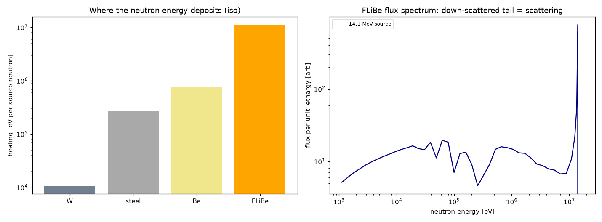

# RESULTS — Tier 5 (scattering + tungsten first wall)

Layered box-torus (cavity → W 0.1 cm → Fe-9Cr steel 1 cm → Be 1 cm → FLiBe 40 cm),
ARC-class size (minor radius ~1 m), square cross-section retained. 400k histories
per config (1M for the thin-wall anchor). **Scattering ON.**

## Verification anchor: the thin-wall limit recovers free-streaming
With all layer densities ×10⁻⁴ (mean free path ≫ device), the layered model must
reproduce the validated Tier-2b free-streaming result. The robust check is the
**steering (mode vs isotropic)**, which cancels geometry:

| quantity | thin wall (free-streaming limit) | Tier-2b free-streaming |
|---|---|---|
| A inboard / outboard | **+40.0% / −19.5%** | +39% / −21% |
| B/C inboard / outboard | **−40.5% / +19.2%** | −41% / +22% |

→ the layered model + compiled source are **correct** with the full geometry.
(The isotropic outboard/inboard *geometry* ratio is 1.18 band-averaged over the
midplane vs 1.146 at exactly z=0 — consistent within the averaging window.)

## The key scattering result: backscatter dilutes the steering
With the **real** FLiBe/Be blanket, neutrons that enter the wall scatter back into
the cavity as a diffuse, direction-blind flux, washing out the directional
contrast:

| mode | inboard: free-streaming → **with scattering** | outboard: free-streaming → **with scattering** |
|---|---|---|
| A | +40% → **+13.2%** | −20% → **−9.2%** |
| B/C | −40% → **−15.0%** | +19% → **+9.0%** |

**Implication (only visible once scattering is on):** free-streaming
**overestimates the steering benefit by ~3×**. B/C still relieves the inboard
center stack, but by **~15%**, not the ~41% the geometric model suggested. This is
exactly the kind of correction the analytic theory cannot provide.

> **Prior work / positioning.** The MC center-stack benefit of polarization is
> already established -- **Bae et al. 2025** (*Nucl. Fusion* 65, 086051; OpenMC,
> Pb-Li spherical tokamak) report +68% magnet lifetime (−40% inboard flux) for
> parallel polarization. Our value-add is the **explicit free-streaming vs.
> full-transport comparison** (the ~3× dilution), which Bae did not isolate -- a
> caution that geometric/analytic steering numbers are optimistic. See PRIOR_WORK_BAE2025.md.

## Where the neutron energy deposits (per source neutron, iso)
| layer | heating [eV] | % of total | damage-energy [eV] |
|---|---|---|---|
| W (first wall) | 1.07e+04 | 0.09% | 1.82e+03 |
| Fe-9Cr steel | 2.76e+05 | 2.26% | 5.50e+04 |
| Be multiplier | 7.67e+05 | 6.28% | 2.41e+04 |
| FLiBe breeder | 1.12e+07 | 91.4% | 3.60e+05 |

Total heating = 1.22e+07 eV/src = **0.87× the 14.1 MeV** neutron energy: the
blanket captures ~87%; the rest leaks out the (unreflected) outer boundary.
Exothermic Li-6(n,t) (+4.78 MeV) and Be(n,2n) add energy, partly offsetting
leakage. The **tungsten first wall absorbs only ~0.1%** (it is a 1 mm armor); the
bulk power and damage land in the FLiBe blanket.

## Down-scattered spectrum (the signature that scattering is active)

The FLiBe flux shows the 14.1 MeV source peak **plus a large down-scattered tail**
to keV energies — impossible in the free-streaming model, and what drives both the
low-energy Li-6 breeding and the material damage.

## Caveats
Thin 1 mm W armor (per ARC); single first-wall/blanket stack, no coolant channels;
294 K cross sections with 900 K FLiBe density. Heating reported per source neutron
(absolute MW/m² needs the source rate). Square cross-section (not ARC's D-shape).

**Tier-5 gate: thin-wall limit recovers the validated free-streaming steering;
the new scattering observables (heating split, damage, down-scattered spectrum)
are available; and scattering is shown to dilute the steering contrast ~3×.**
