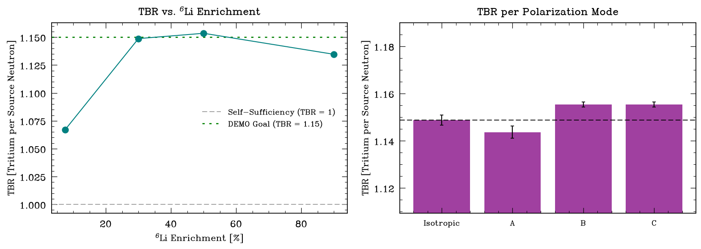

# RESULTS - Tier 6 (FLiBe blanket: tritium breeding ratio)

FLiBe (Li2BeF4) breeder, 40 cm (LIBRA-scale), Li-6 enriched; TBR = tritium produced per source neutron (H3-production in FLiBe). 400,000 histories.

## TBR per polarization mode (constant fusion rate, 30% Li-6)

| mode | TBR | vs iso |
|---|---|---|
| iso | 1.149 +/- 0.002 | +0.00% |
| A | 1.144 +/- 0.003 | -0.44% |
| B | 1.155 +/- 0.001 | +0.57% |
| C | 1.155 +/- 0.001 | +0.57% |

**Headline (honest, vs prior work):** TBR is **modestly polarization-dependent** --
here ~0.6% (B/C parallel-emitting higher, A perpendicular lower). This **reproduces
the sign/trend of Bae et al. 2025** (*Nucl. Fusion* 65, 086051: parallel +2.7%,
perpendicular -1.8% in a Pb-Li spherical tokamak) in an independent code path
(compiled source), breeder (FLiBe), and geometry (square torus). So this is
**independent cross-validation, not a new result**, and the takeaway is: steering
to protect the center stack costs **little** breeding (not *zero* -- the strict
"TBR-independent" claim is wrong; Bae's +2.7% is the careful number).

## TBR vs Li-6 enrichment (iso) -- verification + physics

| Li-6 enrichment | TBR |
|---|---|
| 7.5% | 1.067 +/- 0.001 |
| 30.0% | 1.149 +/- 0.002 |
| 50.0% | 1.154 +/- 0.002 |
| 90.0% | 1.135 +/- 0.002 |

TBR rises with Li-6 then plateaus by ~30-50% -- matching LIBRA's reported behavior (Peterson 2022). Baseline (30%) TBR = 1.149, in the ARC/LIBRA band (ARC >=1.1; DEMO goal 1.15).

## Internal verification (no analytic TBR exists)

- **Li-6/Li-7 split** (iso, 30%): Li-6 contributes 1.040, Li-7 0.099; sum 1.139 vs total 1.149 (consistent). Li-6 dominates (1/v breeding); Li-7 adds the high-energy (n,n't) channel + a multiplier neutron.
- **Enrichment monotonicity + plateau** matches the published LIBRA trend.
- **External code validation:** OpenMC's tritium-production has been benchmarked against the FNG HCPB mock-up (Fusion Sci. Technol. 2025) and ARC multi-code comparisons -- we rely on that for code-level trust, since no closed form exists.

**Caveats:** scoping single-zone blanket, no coolant channels/depletion/extraction, 294 K cross sections with 900 K FLiBe density, square cross-section (not ARC D-shape). TBR here is a production rate, not an engineering breeding ratio.

**Tier-6 gate: TBR in the ARC/LIBRA band; enrichment trend + Li6/Li7 split verify the machinery; steering leaves total TBR ~unchanged while relieving the center stack.**
