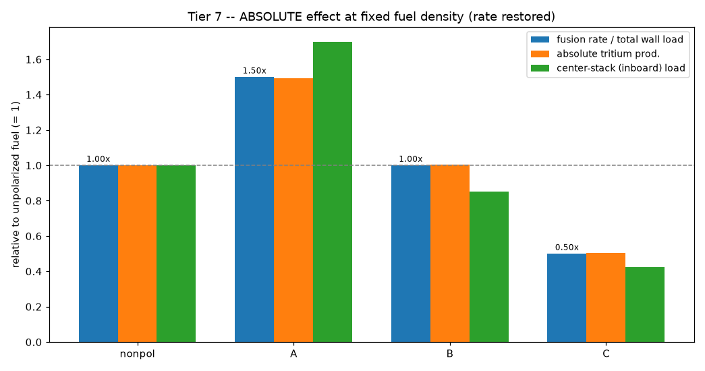

# RESULTS - Tier 7 (absolute rate effect: rate restored)

Tiers 2b/3/6 held the fusion rate constant to isolate *directionality*. Here we restore it: at fixed fuel density the neutron yield scales with the total-rate factor eta = a + 2b/3 + c/3. Pure postprocessing of the Tier 5/6 statepoints (scattering on); all values relative to unpolarized fuel = 1.

## The rate factor eta (the +50% / -50% effect)

| mode | eta | fusion rate vs unpolarized |
|---|---|---|
| nonpol | 0.667 | 1.00x (+0%) |
| A | 1.000 | 1.50x (+50%) |
| B | 0.667 | 1.00x (-0%) |
| C | 0.333 | 0.50x (-50%) |

**A mode = +50% fusion power; C mode = -50%** -- the cross-section enhancement (Kulsrud 1982), which our eta carried all along but which the constant-rate comparisons normalized away.

## Absolute quantities at fixed fuel density (vs unpolarized = 1)

| mode | fusion rate | abs. tritium prod. | center-stack load | outboard load | TBR per neutron |
|---|---|---|---|---|---|
| nonpol | 1.00x | 1.00x | 1.00x | 1.00x | 1.149 |
| A | 1.50x | 1.49x | 1.70x | 1.36x | 1.144 |
| B | 1.00x | 1.01x | 0.85x | 1.09x | 1.155 |
| C | 0.50x | 0.50x | 0.42x | 0.55x | 1.155 |

## What this shows (the rate vs steering trade-off)

- **A (rate play):** +50% power and +49% absolute tritium -- but it steers neutrons *inboard*, so the center-stack load compounds to **1.70x** (rate x inboard steering). Great for power, hard on the center stack.
- **B (free steering):** same power, same breeding, center-stack load **0.85x** -- the sweet spot: directional benefit at no rate penalty.
- **C (steering at a cost):** halves power and breeding (0.50x), giving the lowest absolute center-stack load (0.42x) -- only worth it if center-stack load is the binding constraint.
- **Self-sufficiency is preserved:** the TBR *per neutron* is ~mode-independent (1.144-1.155), so the rate boost breeds proportionally more tritium -- the rate gain does not cost breeding adequacy.

## Scope: where the *other* headline SPF benefits live (NOT modeled here)

- The cross-section **+50%** is in our model (eta, above).
- **Net-electricity / lower-density gains** (disproportionate Q, recirculating power) are a plasma + **systems** power-balance result -- upstream of neutron transport.
- **~10x tritium burn efficiency / inventory** is a plasma **fuel-cycle** (particle-balance) effect -- distinct from our blanket TBR (breeding supply vs burn demand). Both feed tritium self-sufficiency; we model only the blanket-breeding half.

**Tier-7 takeaway: the rate boost is real (A +50%) but lives in a different spin state than the center-stack steering (B/C); B uniquely buys steering at no rate cost.**
